# Price Tracker — Tài liệu Thiết kế Kỹ thuật

> **Mục tiêu sản phẩm:** App mobile cho phép user chụp ảnh một mặt hàng (vd. bó rau ở siêu thị), nhập giá + thông tin, gắn vị trí (GPS tự động hoặc chọn tay), đồng bộ lên cloud, và xem **báo cáo/biểu đồ chi tiêu**.
>
> **Mục tiêu kỹ thuật:** Dự án portfolio để phỏng vấn — kiến trúc rõ ràng, code có tổ chức, các quyết định giải thích được. Tự build backend (NestJS) deploy lên AWS EC2.

---

## 1. Tổng quan & Phạm vi

### 1.1. Triết lý sản phẩm & luồng cốt lõi

App là một **nhật ký chi tiêu bằng hình ảnh**, mặc lớp áo trải nghiệm **camera-first kiểu Locket**: mở app vào thẳng camera, chụp nhanh, vuốt lên xem lịch ảnh theo tháng. Dùng một mình (có đăng nhập, data riêng), **không có** tính năng xã hội/chia sẻ.

```
Mở app → CAMERA → Chụp → Nhập giá (+ thông tin) → Lưu (upload S3 + DB) → quay lại Camera
                                                  ↘ Vuốt lên → Lịch tháng → Chi tiết ngày → Chi tiết entry
                                                  ↘ Tab Thống kê (ngày / tháng / năm)
```

**Mâu thuẫn thiết kế cốt lõi (điểm để nói khi phỏng vấn):** Locket hấp dẫn vì chụp *không ma sát* (2 chạm là xong). Nhưng "giá bắt buộc" buộc phải có bước nhập liệu sau mỗi ảnh. Giải pháp: thiết kế sheet nhập liệu tối giản — đường ngắn nhất chỉ **3 chạm** (chụp → gõ giá → Lưu), mọi thứ khác tự điền hoặc tùy chọn (xem mục 9.2).

### 1.2. Đối tượng & quy mô

- **Multi-user**, mỗi user chỉ thấy dữ liệu của chính mình (cô lập dữ liệu theo `user_id`).
- Cần **authentication** (đăng ký / đăng nhập).
- Quy mô: cá nhân / demo. Không cần thiết kế cho hàng triệu user, nhưng kiến trúc phải *có khả năng* mở rộng (đây là điểm để nói khi phỏng vấn).

### 1.3. Trong & ngoài phạm vi (bản đầu)

| Trong phạm vi (MVP → v1) | Ngoài phạm vi (để sau) |
|---|---|
| Auth (JWT access + refresh) | Đăng nhập mạng xã hội (OAuth) |
| CRUD entries (ảnh + giá + vị trí) | Offline-first / sync engine |
| Upload ảnh lên S3 (pre-signed URL) | Chia sẻ / cộng đồng so giá |
| GPS tự động + chọn vị trí trên bản đồ | Push notification |
| Báo cáo & biểu đồ chi tiêu | Multi-currency conversion realtime |
| Lọc/tìm theo thời gian, danh mục | CI/CD pipeline tự động (có thể thêm sau) |

> **Quyết định quan trọng:** Bản đầu **online-only** (yêu cầu có mạng). Offline-first là một bài toán phức tạp (conflict resolution, local queue) — để Phase sau. Đây là một trade-off có chủ đích, nên ghi nhận để giải thích khi được hỏi.

---

## 2. Kiến trúc tổng thể

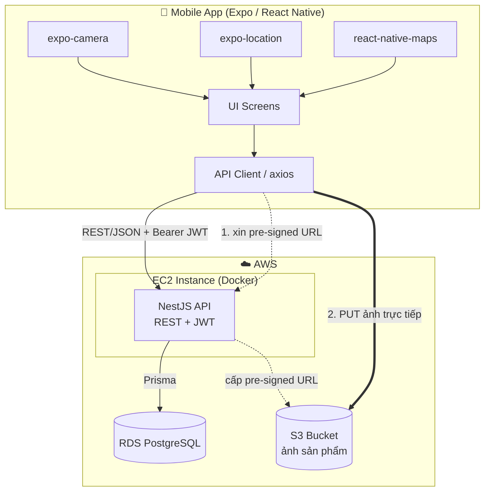

**Giải thích các quyết định chính:**

- **App gọi REST API**, không gọi thẳng DB → tách biệt rõ client/server, bảo mật.
- **Ảnh upload thẳng từ app lên S3** qua *pre-signed URL* do backend cấp. Backend **không** làm trung gian truyền ảnh → tiết kiệm băng thông server, không phình bộ nhớ/RAM của EC2, scale tốt. (Điểm kỹ thuật hay để trình bày.)
- **Backend chỉ lưu `photo_key`** (đường dẫn object trong S3), không lưu binary ảnh trong DB.

---

## 3. Tech Stack & Lý do chọn

| Lớp | Công nghệ | Lý do (dùng để trả lời phỏng vấn) |
|---|---|---|
| Mobile | **Expo (React Native) + TypeScript** | Truy cập camera/GPS/map dễ, build nhanh, không phải đụng native phức tạp |
| State/Data | **React Query (TanStack Query)** | Quản lý server-state, cache, retry, loading/error chuẩn — gọn hơn Redux cho app kiểu CRUD |
| Charts | **react-native-gifted-charts** | Vẽ biểu đồ tròn/cột/đường mượt, API đơn giản |
| Backend | **NestJS + TypeScript** | Cấu trúc module rõ, DI, validation pipe, guard cho auth — trông chuyên nghiệp, dễ giải thích kiến trúc |
| ORM | **Prisma** | Type-safe, migration rõ ràng, schema dễ đọc — demo tốt |
| DB | **PostgreSQL** | Quan hệ rõ, mạnh về aggregate (GROUP BY) phục vụ báo cáo |
| Auth | **JWT (access + refresh)** + bcrypt | Stateless, chuẩn ngành, dễ giải thích |
| Validation | **class-validator + class-transformer** | Tích hợp sẵn NestJS, validate DTO sạch sẽ |
| Storage | **AWS S3** | Lưu ảnh chuẩn, rẻ, pre-signed URL |
| Deploy | **Docker → EC2** (+ RDS) | Đơn giản, dễ hiểu, dễ giải thích cho bản đầu |

---

## 4. Thiết kế Dữ liệu (Data Model)

### 4.1. ERD

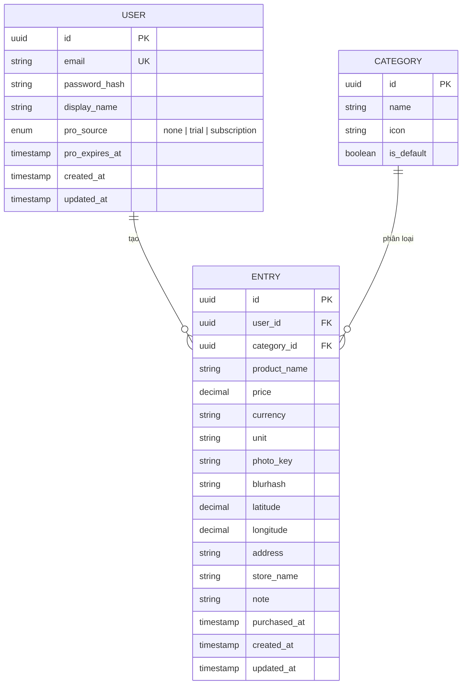

### 4.2. Ghi chú thiết kế

- **`id` dùng UUID** thay vì auto-increment → không lộ số lượng record, an toàn hơn khi public qua API.
- **`price` dùng `decimal`** (không dùng float) → tránh sai số dấu phẩy động với tiền tệ. *(Điểm hay để nói khi phỏng vấn.)*
- **`photo_key`**: chỉ lưu key S3 (vd. `entries/<user_id>/<uuid>.jpg`), không lưu full URL → linh hoạt khi đổi bucket/CDN.
- **`blurhash`**: chuỗi ngắn (~20–30 ký tự) tạo lúc upload, render ra **ảnh mờ** placeholder. Dùng cho 2 việc: (a) hiển thị mượt trong lúc ảnh thật đang tải; (b) làm "lớp che" cho entry bị khóa ở gói Free (mục 14.6) — gửi blurhash thay vì ảnh thật nên **không lộ nội dung**.
- **`purchased_at` tách khỏi `created_at`**: ngày mua thực tế có thể khác ngày nhập liệu → báo cáo chi tiêu chính xác theo thời điểm mua.
- **`category_id` nullable** + bảng `CATEGORY` có sẵn danh mục mặc định (rau củ, thịt cá, đồ khô...) → vừa chuẩn hóa vừa cho phép linh hoạt.
- **Mọi truy vấn `ENTRY` đều scope theo `user_id`** lấy từ JWT → cô lập dữ liệu tuyệt đối giữa các user.
- **Index** trên `(user_id, purchased_at)` và `(user_id, category_id)` → tối ưu cho list và báo cáo.
- **Timezone cho lưới lịch:** ô lịch chia theo **ngày địa phương** của user, nhưng `timestamp` nên lưu UTC. Khi gom nhóm theo ngày (lịch & thống kê), cần quy đổi theo timezone (vd. `AT TIME ZONE 'Asia/Ho_Chi_Minh'`) để ảnh không bị "rơi nhầm ngày". *(Một lỗi kinh điển — biết trước để tránh, và là điểm hay để nói khi phỏng vấn.)*
- **Trường entitlement** (`pro_source`, `pro_expires_at`) là nguồn sự thật để chặn tính năng phía server (xem mục 14). Quyền Pro **được tính động**: `isPro = pro_expires_at != null && now < pro_expires_at` → không cần cron để "hạ cấp", cứ hết hạn là tự về Free. `pro_source` cho biết Pro đến từ **trial khi đăng ký** hay **subscription trả phí**. Bản đầu để gọn ngay trên `USER`; nếu cần lịch sử giao dịch/hoàn tiền có thể tách bảng `SUBSCRIPTION` riêng sau.

---

## 5. API Specification (REST)

Base URL: `/api/v1`. Tất cả endpoint (trừ auth) yêu cầu header `Authorization: Bearer <access_token>`.

### 5.1. Auth

| Method | Endpoint | Mô tả | Body / Trả về |
|---|---|---|---|
| POST | `/auth/register` | Đăng ký | `{ email, password, displayName }` → `{ user, accessToken, refreshToken }` |
| POST | `/auth/login` | Đăng nhập | `{ email, password }` → `{ user, accessToken, refreshToken }` |
| POST | `/auth/refresh` | Làm mới token | `{ refreshToken }` → `{ accessToken, refreshToken }` |
| GET | `/auth/me` | Lấy profile | → `{ user }` |

### 5.2. Entries

| Method | Endpoint | Mô tả |
|---|---|---|
| GET | `/entries` | List có phân trang + filter: `?page=&limit=&category=&from=&to=&search=&store=` |
| GET | `/entries/calendar?month=YYYY-MM` | **Dữ liệu lưới lịch tháng**: mỗi ngày có entry trả về `{ date, count, coverPhotoKey }` — `coverPhotoKey` là **ảnh đầu tiên** trong ngày (ảnh đại diện ô lịch) |
| GET | `/entries/:id` | Chi tiết 1 entry |
| POST | `/entries` | Tạo entry: `{ productName, price, currency, unit, categoryId, photoKey, latitude, longitude, address, storeName, note, purchasedAt }` |
| PATCH | `/entries/:id` | Cập nhật |
| DELETE | `/entries/:id` | Xóa (kèm xóa object S3) |

### 5.3. Upload (ảnh)

| Method | Endpoint | Mô tả |
|---|---|---|
| POST | `/uploads/presign` | Body `{ contentType, ext }` → `{ uploadUrl, photoKey }`. App `PUT` ảnh thẳng lên `uploadUrl`, sau đó gửi `photoKey` khi tạo entry. |
| GET | `/uploads/photo-url?key=` | Cấp **presigned GET URL** (hết hạn ngắn) để xem ảnh. **Từ chối** nếu ảnh thuộc entry bị khóa ở gói Free (mục 14.6). |

### 5.4. Reports (tính năng trọng tâm)

| Method | Endpoint | Mô tả | Trả về |
|---|---|---|---|
| GET | `/reports/summary` | Tổng quan theo khoảng `?from=&to=` | `{ totalSpent, entryCount, avgPerEntry, currency }` |
| GET | `/reports/by-category` | Phân bổ theo danh mục | `[{ categoryName, total, percentage }]` → biểu đồ tròn |
| GET | `/reports/time-series` | Chi tiêu theo thời gian `?groupBy=day\|month\|year` | `[{ period, total }]` → biểu đồ cột/đường |
| GET | `/reports/top-stores` | Top cửa hàng chi nhiều nhất | `[{ storeName, total, count }]` |

### 5.5. Quy ước chung

- **Phân trang**: `{ data: [...], meta: { page, limit, total, totalPages } }`.
- **Lỗi**: format chuẩn NestJS `{ statusCode, message, error }`.
- **Validation**: DTO + `class-validator`, sai → `400` kèm chi tiết field lỗi.

### 5.6. Subscription / Entitlement (xem chi tiết mục 14)

| Method | Endpoint | Mô tả |
|---|---|---|
| GET | `/me/entitlement` | Trả về quyền hiện tại (tính động): `{ isPro, proSource, proExpiresAt, limits: { entriesPerMonth } }` để app hiển thị đúng (vd. còn bao nhiêu ngày trial) |
| POST | `/webhooks/revenuecat` | **Webhook** RevenueCat gọi tới khi mua/gia hạn/hủy → cập nhật `pro_source='subscription'` + `pro_expires_at`. Xác thực bằng signature/secret, không cần JWT user |

> Khi tạo entry vượt trần Free, `POST /entries` trả **`402 Payment Required`** (hoặc `403`) kèm thông điệp gợi ý nâng cấp. Các endpoint chỉ-Pro (vd. `time-series?groupBy=year`, export) được bọc bởi `EntitlementGuard`.

### 5.7. OCR (Pro — hỗ trợ nhập liệu)

| Method | Endpoint | Mô tả |
|---|---|---|
| POST | `/ocr/parse` | Body `{ photoKey }` → `{ price?, productName?, rawText }`. Backend gọi **AWS Textract** đọc thẳng object trong S3, áp heuristic tách giá/tên. **Bọc `EntitlementGuard` (chỉ Pro).** Kết quả chỉ để **pre-fill**, user sửa được. |

---

## 6. Luồng xác thực (Auth Flow)

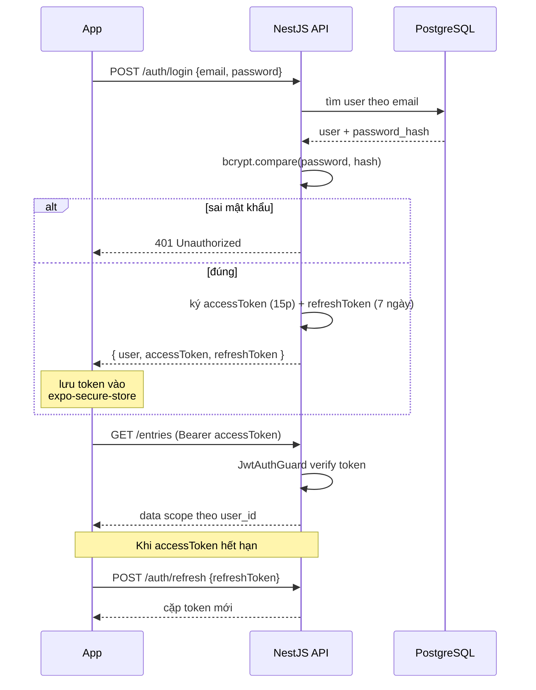

**Ghi chú bảo mật:**
- Token lưu bằng **`expo-secure-store`** (Keychain/Keystore), không lưu AsyncStorage thường.
- **Access token ngắn hạn** (15 phút) + **refresh token dài hạn** (7 ngày) → giảm rủi ro khi token bị lộ.
- Mật khẩu hash bằng **bcrypt** (cost ≥ 10), không bao giờ lưu plaintext.

---

## 7. Luồng Upload ảnh (Pre-signed URL)

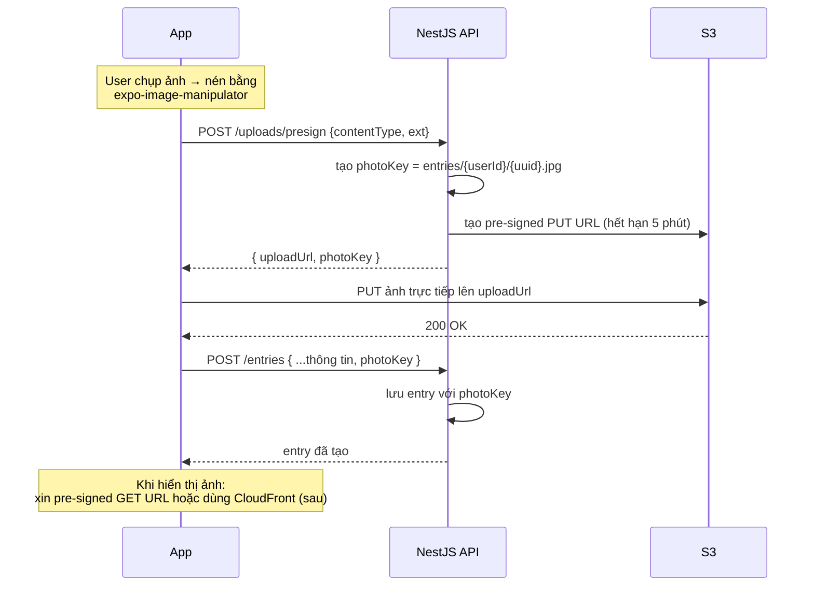

**Tại sao không upload qua server?** Truyền ảnh qua backend tốn RAM/băng thông EC2, dễ nghẽn khi nhiều request. Upload thẳng lên S3 giảm tải server và scale tốt hơn — đồng thời S3 lo độ bền dữ liệu.

---

## 8. Thiết kế phần Báo cáo chi tiêu

Đây là tính năng bạn ưu tiên, nên đầu tư kỹ. **Nguyên tắc: đẩy tính toán xuống PostgreSQL** (GROUP BY, SUM) thay vì kéo hết data về app rồi tính — nhanh, ít tốn băng thông, đúng tư duy backend.

**Ví dụ query "chi tiêu theo danh mục":**

```sql
SELECT c.name AS category_name, SUM(e.price) AS total, COUNT(*) AS cnt
FROM entries e
LEFT JOIN categories c ON e.category_id = c.id
WHERE e.user_id = $1
  AND e.purchased_at BETWEEN $2 AND $3
GROUP BY c.name
ORDER BY total DESC;
```

**Màn hình Thống kê (tab riêng) gồm:**
- Bộ chuyển **Ngày / Tháng / Năm** ở đầu màn hình → đổi mốc tổng hợp.
- Thẻ tổng quan: tổng chi tiêu kỳ đang chọn, số lần mua, trung bình/lần.
- **Biểu đồ cột/đường**: chi tiêu theo trục thời gian tương ứng (các ngày trong tháng / các tháng trong năm / các năm).
- **Biểu đồ tròn**: phân bổ theo danh mục trong kỳ.
- **Top cửa hàng / sản phẩm** chi nhiều nhất.

> Lưu ý phân tách mối quan tâm: **lịch giữ thuần ảnh** (chất Locket, không hiện số tiền), còn **số tiền** chỉ xuất hiện ở (a) chi tiết từng entry và (b) tab Thống kê này. Hai mối quan tâm tách bạch, giao diện không bị rối.

---

## 9. Màn hình Mobile App (camera-first)

### 9.1. Bản đồ điều hướng

Camera là trung tâm. Mọi màn hình khác với tới bằng cử chỉ/icon ngay trên màn camera — **không dùng bottom tabs cổ điển**.

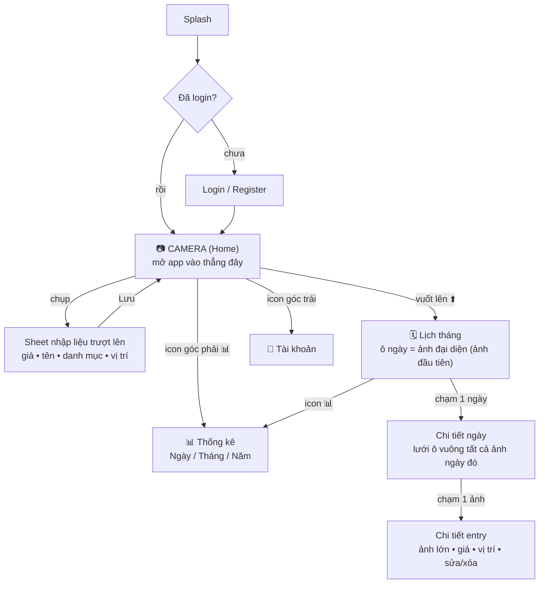

### 9.2. Luồng chụp – nhập – lưu (tối giản ma sát)

Mục tiêu đường nhanh nhất = **3 chạm**: chụp → gõ giá → Lưu.

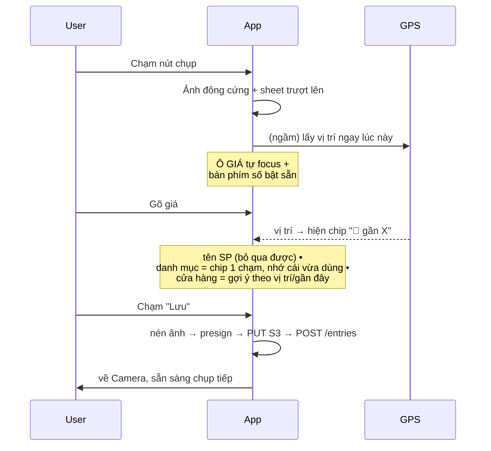

**Các thủ thuật giảm ma sát:** ô giá auto-focus + bàn phím số (đường nhanh nhất); GPS chạy ngầm ngay khi bấm chụp nên lúc gõ xong giá đã có sẵn vị trí; danh mục là chip 1 chạm và nhớ lựa chọn gần nhất; tên sản phẩm để trống được; tên cửa hàng gợi ý theo vị trí hiện tại / gần đây; nút "đổi vị trí" mở map chỉ khi cần.

### 9.3. Lịch tháng & chi tiết ngày

- **Lịch tháng**: lưới ô ngày, ngày nào có entry thì hiện **ảnh đại diện = ảnh đầu tiên chụp trong ngày** (lấy từ `coverPhotoKey`). Lịch **chỉ hiện ảnh**, không hiện số tiền → giữ giao diện sạch, đúng tinh thần Locket.
- **Chi tiết ngày**: chạm vào ô ngày → lưới ô vuông (grid) tất cả ảnh ngày đó.
- **Chi tiết entry**: chạm 1 ảnh → ảnh lớn + đầy đủ thông tin (giá, danh mục, vị trí, cửa hàng, ghi chú) + sửa/xóa.

### 9.4. Danh sách màn hình

- **Auth**: Login / Register, lưu token an toàn (`expo-secure-store`).
- **Camera (Home)**: full-screen camera, nút chụp lớn, icon Profile (góc trái) + Thống kê (góc phải), gợi ý vuốt lên để mở lịch.
- **Sheet nhập liệu**: như mục 9.2.
- **Lịch tháng / Chi tiết ngày / Chi tiết entry**: như mục 9.3.
- **Thống kê**: tab Ngày/Tháng/Năm + biểu đồ (mục 8).
- **Tài khoản**: thông tin user, đăng xuất.

---

## 10. Cấu trúc thư mục dự kiến

**Backend (NestJS):**
```
backend/
├── src/
│   ├── auth/          # controller, service, guards, strategies, dto
│   ├── users/
│   ├── entries/
│   ├── categories/
│   ├── uploads/       # logic pre-signed URL (S3)
│   ├── reports/       # các endpoint aggregate
│   ├── common/        # guards, interceptors, filters, decorators
│   ├── prisma/        # PrismaService + module
│   └── main.ts
├── prisma/
│   ├── schema.prisma
│   └── migrations/
├── Dockerfile
├── docker-compose.yml # api + postgres (dev local)
└── .env.example
```

**Mobile (Expo):**
```
mobile/
├── src/
│   ├── api/           # axios client, hooks React Query
│   ├── screens/       # Auth, Camera, CaptureSheet, Calendar, DayDetail, EntryDetail, Stats, Profile
│   ├── components/    # tái sử dụng (CalendarCell, PhotoGrid, Chart, MapPicker, CategoryChips...)
│   ├── navigation/    # native-stack (Camera là root) + modal cho CaptureSheet
│   ├── hooks/         # useCamera, useLocation, useAuth
│   ├── store/         # auth context / token
│   └── lib/           # utils, constants
├── app.json
└── .env
```

---

## 11. Triển khai lên AWS EC2

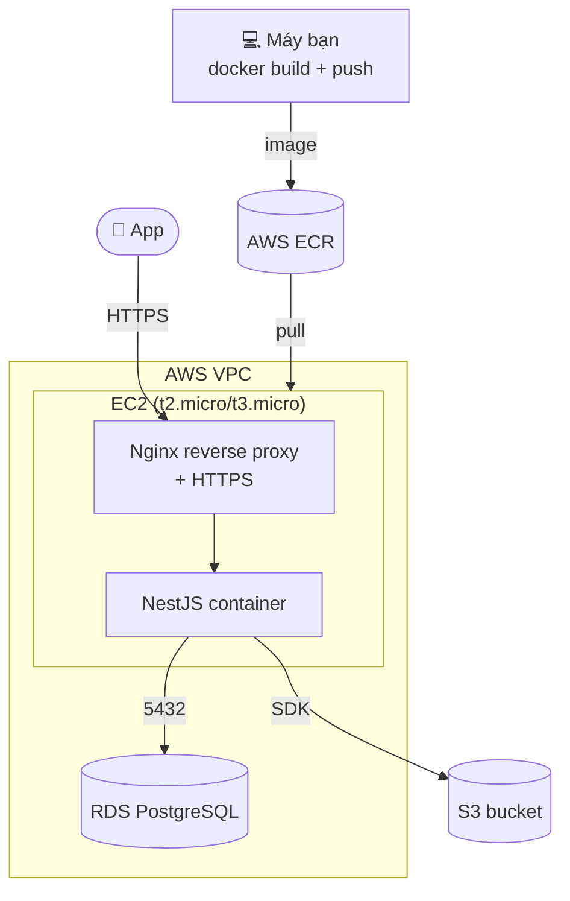

**Các bước deploy (sẽ chi tiết trong tài liệu hướng dẫn riêng):**
1. Build Docker image, push lên **AWS ECR**.
2. Tạo EC2 instance (Amazon Linux / Ubuntu), cài Docker.
3. Tạo RDS PostgreSQL (free tier `db.t3.micro`), cấu hình Security Group cho EC2 truy cập.
4. Tạo S3 bucket + IAM role/policy cho EC2 ký pre-signed URL.
5. Pull image về EC2, chạy container, set env (DB URL, JWT secret, AWS creds qua IAM role).
6. Nginx reverse proxy + HTTPS (Let's Encrypt / certbot) trước container.
7. Trỏ domain (nếu có).

**Lưu ý chi phí:** EC2 `t2.micro` + RDS `db.t3.micro` nằm trong **AWS Free Tier 12 tháng**. S3 chi phí không đáng kể ở mức demo. Sau free tier sẽ phát sinh phí — nhớ tắt instance khi không demo.

**Bảo mật hạ tầng:**
- RDS đặt trong subnet private, chỉ EC2 truy cập (không expose ra internet).
- Dùng **IAM role** gắn vào EC2 thay vì hardcode AWS access key.
- Secrets (JWT secret, DB password) qua biến môi trường / SSM Parameter Store, **không commit vào git**.

---

## 12. Checklist bảo mật (để nói khi phỏng vấn)

- [ ] Mật khẩu hash bcrypt, không lưu plaintext.
- [ ] JWT access ngắn hạn + refresh token.
- [ ] Mọi query scope theo `user_id` từ token (chống truy cập chéo dữ liệu).
- [ ] Validate toàn bộ input qua DTO (chống dữ liệu rác / injection cơ bản).
- [ ] Prisma dùng parameterized query (chống SQL injection).
- [ ] Rate limiting cho auth endpoints (`@nestjs/throttler`).
- [ ] CORS cấu hình đúng origin.
- [ ] Token lưu `expo-secure-store` phía app.
- [ ] Pre-signed URL hết hạn ngắn (5 phút).
- [ ] Secrets không hardcode, không commit.

---

## 13. Lộ trình xây dựng (Roadmap)

> **Nguyên tắc: backend trước, chạy ổn local rồi mới làm app.** Mỗi phase xong và chạy được mới sang phase kế.

| Phase | Nội dung | Kết quả |
|---|---|---|
| **0. Setup** | Khởi tạo NestJS, Prisma, Postgres qua docker-compose | Project chạy local, kết nối DB |
| **1. Auth** | Register/Login/Refresh, JWT, guards, bcrypt | Đăng nhập hoạt động, test bằng Postman |
| **2. Entries** | CRUD + filter + phân trang + endpoint `/entries/calendar` | Quản lý dữ liệu giá + dữ liệu cho lịch |
| **3. Uploads** | Pre-signed URL S3 | Upload ảnh hoạt động |
| **4. Reports** | Endpoint aggregate (summary, by-category, time-series ngày/tháng/năm, top-stores) | API thống kê sẵn sàng |
| **5. Mobile MVP** | Auth + **Camera-first** + sheet nhập liệu + GPS + lưu | App chụp & ghi giá được |
| **6. Mobile Lịch** | Lịch tháng (ảnh đại diện) + chi tiết ngày + chi tiết entry | Xem lại theo lịch hoàn chỉnh |
| **7. Mobile Thống kê** | Tab Ngày/Tháng/Năm + biểu đồ | Tính năng trọng tâm hoàn chỉnh |
| **8. Mobile Map** | Chọn vị trí tùy chỉnh trên map | Hoàn thiện vị trí |
| **9. Deploy** | Docker + EC2 + RDS + S3 + Nginx HTTPS | App chạy thật trên AWS (bàn sau) |
| **10. Freemium** | Trường entitlement + `EntitlementGuard` + trần entry + paywall + RevenueCat/IAP + webhook | Có thể thu phí (cần build thật để test IAP) |
| **11. (Tùy chọn)** | OCR tự động điền (Textract, Pro), CSV/PDF export, ngân sách & cảnh báo, đa tiền tệ, CI/CD, offline, widget | Nâng cao |
| **12. AI mở rộng** | Phân loại tự động, insight & hỏi đáp NL, gom sản phẩm (pgvector) — xem mục 15 | Khác biệt hóa sản phẩm |

---

## 14. Mô hình kiếm tiền (Freemium)

**Nguyên tắc:** Free phải đủ dùng để người ta gắn bó và tích lũy dữ liệu; đặt rào đúng chỗ người dùng nghiêm túc nhận nhiều giá trị nhất. Hai đòn bẩy kết hợp: **(a) trần entry/tháng** (bảo vệ chi phí lưu trữ S3) + **(b) khóa phân tích dài hạn** (giá trị tích lũy theo thời gian → động lực nâng cấp mạnh nhất).

### 14.1. So sánh gói

| Tính năng | Free | Pro |
|---|---|---|
| Chụp ảnh + nhập giá + vị trí | ✅ (không bao giờ chặn) | ✅ |
| Số entry / tháng | ~40–50 (trần mềm) | Không giới hạn |
| Lịch ảnh theo tháng | ✅ **3 tháng gần nhất xem rõ**, cũ hơn bị **blur/khóa** | ✅ Toàn bộ lịch sử |
| Xem chi tiết entry (ảnh nét + giá) | ✅ trong 3 tháng gần nhất | ✅ mọi thời điểm |
| Thống kê tháng hiện tại + danh mục cơ bản | ✅ | ✅ |
| **Thống kê dài hạn** (năm, xu hướng nhiều tháng, so sánh kỳ) | ❌ | ✅ |
| **Ngân sách & cảnh báo vượt hạn mức** | ❌ | ✅ |
| **Tự động điền giá/tên từ ảnh (OCR)** | ❌ | ✅ |
| **Trợ lý AI** (tóm tắt chi tiêu, hỏi đáp, gợi ý) — *mở rộng sau* | ❌ | ✅ |
| **Xuất CSV / PDF** | ❌ | ✅ |
| Danh mục tùy chỉnh / tag | Hạn chế (danh mục mặc định) | Không giới hạn |
| Đa tiền tệ | ❌ | ✅ |
| Widget màn hình chính (khi làm) | ❌ | ✅ |
| Độ phân giải ảnh lưu trữ | Nén mạnh hơn | Giữ nét hơn |

**Lưu ý quan trọng:** *không bao giờ xóa* dữ liệu của Free. Dữ liệu cũ hơn 3 tháng chỉ bị **blur/khóa** (vẫn lưu nguyên trên server), và **mở khóa lại ngay lập tức** khi nâng Pro — xem được từ đầu đến nay. Blur (thay vì ẩn hẳn) còn cho người dùng *thấy* mình đang bỏ lỡ gì → động lực nâng cấp. Chi tiết cơ chế ở mục 14.6.

### 14.2. Luồng subscription & enforcement

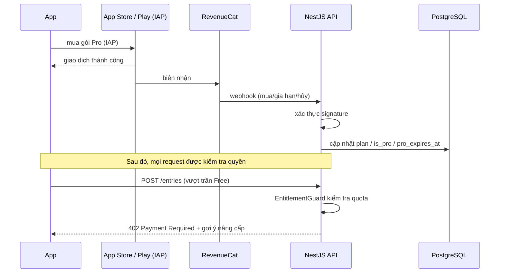

### 14.3. Triển khai kỹ thuật

- **RevenueCat** đặt trên IAP của App Store/Play → lo biên nhận, gia hạn, đồng bộ đa nền tảng. Chuẩn ngành, đáng nói khi phỏng vấn.
- Backend giữ **nguồn sự thật entitlement** (`pro_source` + `pro_expires_at` trên `USER`), cập nhật qua **webhook** (với subscription) hoặc cấp khi đăng ký (với trial — mục 14.5). Quyền Pro tính động từ `pro_expires_at`.
- **Enforce phía server** — `EntitlementGuard` (NestJS) chặn endpoint Pro; tạo entry vượt trần trả `402`. **Không tin client** (ẩn UI là chưa đủ).
- Phía app: gọi `/me/entitlement` để hiện đúng nút "Nâng cấp", màn hình paywall, và disable tính năng Pro một cách thân thiện.

> ⚠️ **Lưu ý thực tế:** IAP chỉ chạy trên **build thật** (TestFlight / thiết bị / dev build), **không** test được trên Expo Go thường. Vì vậy phần này nằm ở **giai đoạn sau** trong roadmap, sau khi tính năng cốt lõi đã chạy ổn.

### 14.4. Cấu trúc giá (packages)

Pro có **2 gói** cấu hình thành một *offering* trên RevenueCat:

| Gói | Chu kỳ | Định hướng giá |
|---|---|---|
| **Pro hàng tháng** | 1 tháng, tự gia hạn | Giá nền, cam kết thấp để dễ thử |
| **Pro hàng năm** | 12 tháng, tự gia hạn | **Giảm giá** so với trả tháng (vd. tương đương ~2 tháng miễn phí) → khuyến khích cam kết dài, dòng tiền ổn định |

- Hai gói cùng mở khóa **đúng một bộ quyền Pro** (entitlement `pro`) — chỉ khác chu kỳ thanh toán. Backend không cần phân biệt tháng/năm, chỉ quan tâm `is_pro` + `pro_expires_at`.
- Có thể thêm **free trial** ngắn (vd. 7 ngày) cho gói năm để tăng chuyển đổi — RevenueCat hỗ trợ sẵn.
- Con số giá cụ thể (VND) chốt sau, ở giai đoạn dựng paywall — không ảnh hưởng kiến trúc.

### 14.5. Tháng đầu miễn phí (trial cấp khi đăng ký)

User mới được **1 tháng Pro miễn phí, không cần nhập thẻ**; hết tháng **tự về Free** (không tự động tính phí). Đây là trial **do server tự cấp**, hoàn toàn tách rời IAP/store.

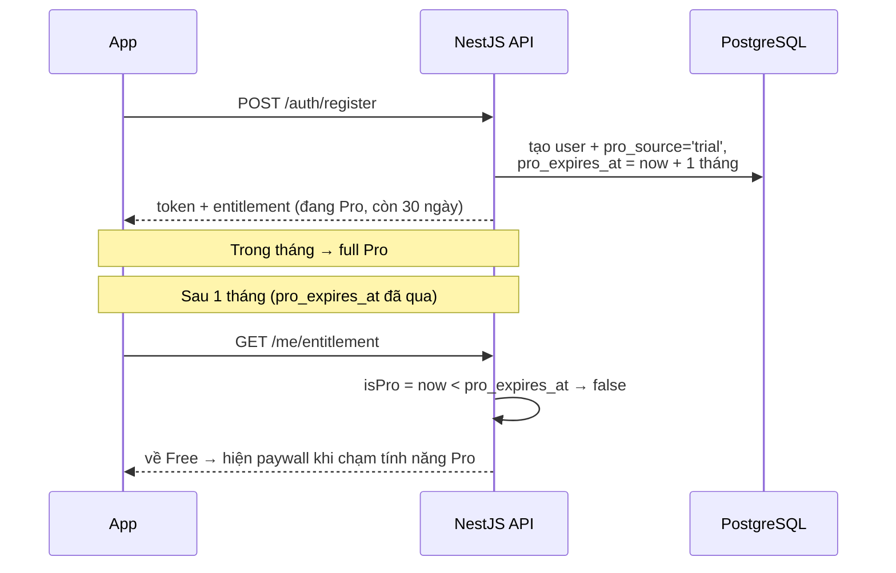

**Các điểm thiết kế:**
- **Tính động, không cần cron:** không có job nào "hạ cấp" user. Mỗi request chỉ so `now` với `pro_expires_at`. Hết hạn là tự Free. *(Điểm hay để nói khi phỏng vấn — tránh được cả một lớp lỗi đồng bộ trạng thái.)*
- **Guard dùng chung:** `EntitlementGuard` không quan tâm Pro đến từ trial hay subscription — chỉ hỏi "còn quyền không?". Cùng triết lý với việc không phân biệt gói tháng/năm.
- **Tương tác với trần entry:** trong tháng trial → không giới hạn entry. Hết trial → áp lại trần Free (~40–50/tháng) cho **entry mới**; **dữ liệu cũ vẫn giữ nguyên**, không xóa. Nếu trong trial user đã tạo vượt trần thì vẫn xem được hết, chỉ là tạo mới sẽ bị chặn cho tới khi nâng cấp.
- **Chống lạm dụng:** vì trial gắn theo tài khoản (không qua store), nên **yêu cầu xác thực email** khi đăng ký để hạn chế tạo tài khoản ảo lấy trial liên tục. (Có thể siết thêm theo thiết bị sau nếu cần.)
- **Test sớm được:** vì không phụ thuộc IAP, trial có thể xây & test ngay từ giai đoạn backend, không cần build thật — khác với phần subscription trả phí.

### 14.6. Giới hạn lịch sử cho Free (blur 3 tháng)

Free xem rõ **3 tháng gần nhất**; entry cũ hơn bị **blur/khóa** nhưng **không xóa**. Nâng Pro → mở khóa toàn bộ ngay.

- **Cửa sổ thời gian:** `purchased_at >= now - 3 tháng` (tính theo **timezone địa phương** của user, giống logic lịch ở mục 4.2). Đây là cửa sổ *trượt*: mỗi ngày trôi qua, tháng cũ nhất tự rơi vào vùng khóa.
- **Enforce phía server (mấu chốt bảo mật):** với entry **ngoài cửa sổ** mà user là Free, API **không** trả `photo` URL và `price` — chỉ trả `{ id, purchasedAt, blurhash, locked: true }`. Client render blurhash thành ảnh mờ + badge 🔒. **Không tin client tự blur**, vì ảnh gốc/giá nếu đã gửi xuống thì xem được qua network/DevTools.

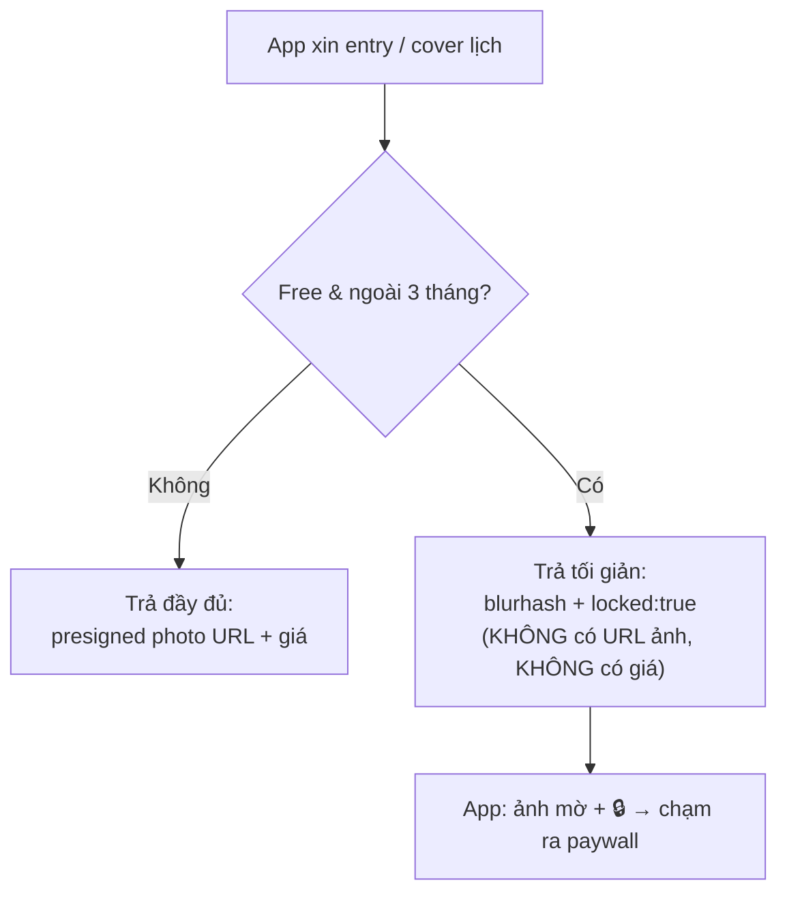

- **Ảnh hưởng tới các endpoint:**
  - `GET /entries/calendar` — ô ngày ngoài cửa sổ trả `blurhash` thay cho `coverPhotoKey`, kèm `locked: true`.
  - `GET /entries` & `GET /entries/:id` — entry bị khóa lược bỏ `photo`/`price`, thêm `locked: true`.
  - `GET /uploads/photo-url` (presigned GET) — **từ chối** cấp URL cho ảnh bị khóa.
- **Mở khóa khi nâng Pro:** không cần migrate gì — `EntitlementGuard` thấy `isPro=true` thì bỏ qua bộ lọc cửa sổ, trả đầy đủ. Dữ liệu chưa bao giờ mất nên "xuất hiện lại" tức thì.
- **Quan hệ với "thống kê dài hạn":** hai cái bổ trợ nhau — cửa sổ 3 tháng khóa *xem dữ liệu thô cũ*, còn khóa phân tích dài hạn chặn *biểu đồ tổng hợp năm/xu hướng*. Cùng một thông điệp: muốn nhìn xa hơn 3 tháng → nâng Pro.

### 14.7. OCR tự động điền (Pro) — *mở rộng sau*

User chụp ảnh có sẵn giá/tên (vd. tem giá, hóa đơn) → app **tự điền** giá + tên vào form, **user vẫn sửa được**. Đây là **hỗ trợ nhập liệu**, không phải nguồn sự thật.

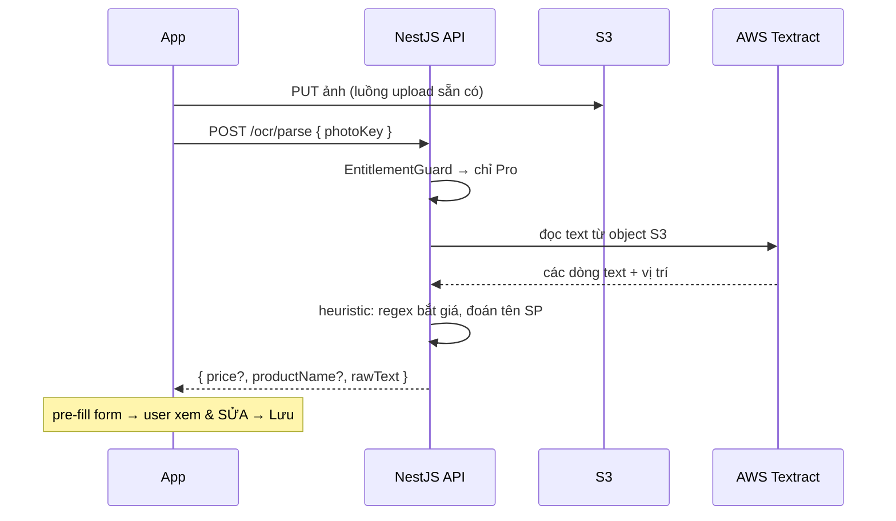

**Các điểm thiết kế:**
- **Vì sao để Pro:** OCR đám mây có **chi phí biên thật** mỗi lần gọi → gating Pro đúng với "value metric" (giống trần entry bảo vệ chi phí S3). Nên cân nhắc thêm **fair-use cap** ngay cả với Pro để tránh hóa đơn Textract tăng vọt.
- **Server-side, không gọi thẳng từ app:** giữ AWS creds an toàn, kiểm tra quyền & chi phí tập trung, chống lạm dụng. Textract **đọc thẳng từ S3** nên không phải gửi lại ảnh.
- **Chỉ hỗ trợ, luôn cho sửa:** OCR hay đọc sai (font, ánh sáng, tiền tệ). Luôn pre-fill rồi để user xác nhận — không tự lưu. Thực tế **giá** (bắt bằng regex số/tiền tệ) đáng tin hơn **tên sản phẩm** (khó đoán) — nên đặt kỳ vọng tên SP là "best-effort".
- **Phương án giảm chi phí về sau:** có thể chuyển sang **OCR on-device** (ML Kit / Apple Vision) — *miễn phí*, chạy trên máy, không tốn chi phí biên; đổi lại độ chính xác kém ổn định hơn và cần dev build. Khi đó OCR vẫn có thể giữ là điểm Pro (giá trị tiện ích) dù không còn tốn phí.
- **Thêm vào stack:** mục này bổ sung **AWS Textract** vào hạ tầng (cùng hệ AWS, nhất quán).

---

## 15. Tính năng AI (mở rộng)

App tích lũy dữ liệu giàu ngữ cảnh (ảnh + giá + địa điểm + danh mục + thời gian) → mảnh đất tốt cho AI. **OCR (mục 14.7) là viên gạch AI đầu tiên**; dưới đây là các hướng mở rộng. Gần như tất cả có **chi phí biên** (gọi LLM/vision) → mặc định **gating Pro**, đúng mạch "value metric"; riêng vài cái rẻ có thể on-device.

### 15.1. Nhóm A — Giảm ma sát nhập liệu (nối tiếp OCR)

- **Tự động phân loại danh mục:** từ ảnh + tên SP, AI đoán danh mục (rau củ, thịt cá...) → bỏ bước chọn chip. Rẻ nhất, có thể on-device hoặc 1 lần gọi LLM nhỏ.
- **Nhận diện sản phẩm từ ảnh (vision):** kể cả khi ảnh không có chữ, AI nhìn ảnh gợi ý tên SP. Bổ trợ OCR.
- **Đọc hóa đơn nhiều dòng:** chụp một hóa đơn dài → AI tách thành **nhiều entry** cùng lúc. Bước nhảy giá trị lớn nhưng khó hơn (Textract AnalyzeExpense hoặc vision LLM).

### 15.2. Nhóm B — Biến dữ liệu thành insight (phần "đắt giá")

- **Theo dõi giá cùng món theo thời gian/địa điểm:** "Món này ở chợ A rẻ hơn siêu thị B 20%", "tháng trước 15k, giờ 20k". Đúng lý do app tồn tại.
- **Tóm tắt chi tiêu bằng ngôn ngữ tự nhiên:** mỗi tháng AI viết "Bạn chi nhiều hơn 15% cho thịt cá, chủ yếu ở cửa hàng X" — thay vì chỉ biểu đồ.
- **Hỏi đáp dữ liệu bằng tiếng Việt:** "Tháng trước tôi tiêu bao nhiêu cho rau?" → AI dịch thành truy vấn và trả lời.
- **Dự báo & gợi ý ngân sách:** từ xu hướng, AI ước tính chi tiêu cuối tháng + đề xuất hạn mức.

### 15.3. Nền tảng cần có trước: gom đúng sản phẩm (entity resolution)

Hầu hết Nhóm B cần nhận ra "rau muống", "Rau Muống", "bó rau muống" là **cùng một thứ**. Cách làm: tạo **embedding** cho tên/ảnh sản phẩm rồi cụm các mục tương tự. Đây là *viên gạch móng* cho mọi tính năng so giá thông minh — nếu đi Nhóm B, xây cái này trước.

- **Lưu embedding ngay trong Postgres** bằng extension **pgvector** (similarity search) → không cần thêm vector DB riêng, tận dụng đúng DB sẵn có. *(Điểm hay để nói khi phỏng vấn.)*

### 15.4. Triển khai & chi phí

- **Server-side orchestration:** backend gọi LLM/vision (không lộ API key cho client), kiểm tra quyền + chi phí tập trung — **cùng pattern với OCR** (mục 14.7).
- **Tùy chọn model:** **AWS Bedrock** (cùng hệ AWS, nhất quán hạ tầng) hoặc API LLM bên ngoài; embedding qua model nhúng + pgvector.
- **Kiểm soát chi phí:** mỗi tính năng AI nên có **fair-use cap** kể cả với Pro; cache kết quả khi hợp lý (vd. tóm tắt tháng tính 1 lần rồi lưu).
- **Luôn cho sửa / minh bạch:** giống OCR, output AI là *gợi ý*, không phải nguồn sự thật — user xác nhận/sửa được.

> **Khuyến nghị ưu tiên:** cặp **tóm tắt chi tiêu + hỏi đáp ngôn ngữ tự nhiên** là "ăn tiền" nhất cho portfolio — wow khi demo, khuếch đại đúng giá trị cốt lõi, khớp tầng "thống kê dài hạn" của Pro, và cho thấy năng lực tích hợp LLM vào sản phẩm thật. Tất cả thuộc nhóm *mở rộng sau*, làm khi lõi app đã chạy ổn.

---

## 16. Quyết định đã chốt

| # | Vấn đề | Quyết định |
|---|---|---|
| 1 | **Domain & HTTPS** | Gác lại — xử lý **sau khi app đã hoạt động** (lúc deploy mới bàn) |
| 2 | **Currency** | **VND-first**: MVP cố định VND (trường `currency` mặc định `"VND"`). Đa tiền tệ là tính năng Pro / phase sau |
| 3 | **Registry** | Dùng **AWS ECR** (đúng chuẩn AWS, ăn điểm phỏng vấn) |
| 4 | **CI/CD** | **Có** (GitHub Actions) nhưng làm **sau cùng**, khi app đã hoàn thành |

> **Định hướng hiện tại:** *chưa* đụng tới deploy/hạ tầng. Tập trung hoàn thiện **thiết kế + xây app (backend → mobile)** trước; toàn bộ phần AWS/ECR/CI/CD/domain để dành cho giai đoạn cuối.

---

*Tài liệu này là bản thiết kế để review. Bước tiếp theo: khởi tạo khung backend Phase 0 + 1 (hoặc dựng wireframe trực quan các màn hình).*
